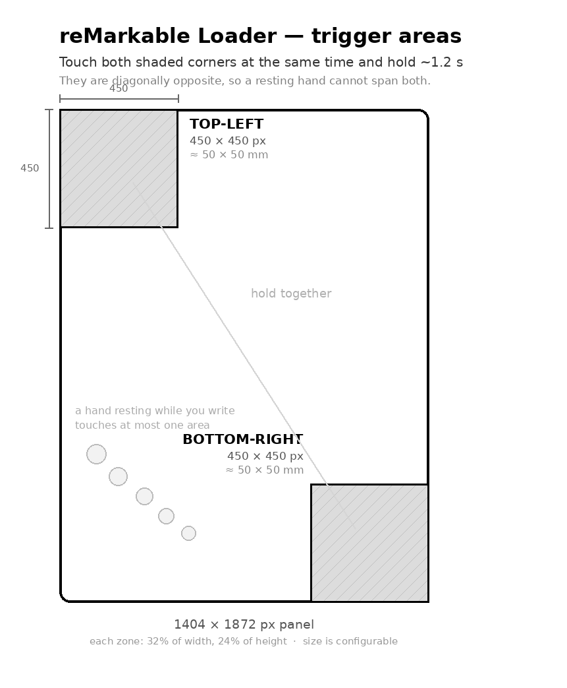

# reMarkable Loader

Run your own apps on a **reMarkable 2** without giving up the tablet.

**Touch the top-left and bottom-right corners at the same time and hold
~1.2 s**:

- in the stock UI → an **Apps** page opens
- in one of your apps → you go back to the stock UI



Each corner zone is **450 × 450 px** (about 50 × 50 mm — a comfortable thumb
target you can find without looking), and the two are diagonally opposite on
purpose: **a hand resting on the panel while you write covers one contiguous
area and physically cannot reach both.** An earlier version triggered on "4
fingers held", which fired constantly from writing posture — a resting palm
easily reports four or more contacts.

Zone size is configurable (`--corner-size`), and the daemon logs the exact
zones it armed with, plus each corner entry/exit, so you can confirm they are
where you expect.

No PC needed once installed, and no icon to look for — reMarkable's UI has no
concept of third-party apps, and only one process can own the e-paper display
at a time, so an app *replaces* the stock UI rather than living inside it.
This project is the doorway between them.

Stock `xochitl` has no two-corner gesture, so this cannot collide with
built-in behaviour.

## What's here

```
switcher/            the gesture daemon (plain C, no Qt)
  modeswitchd.c      passive evdev reader
  gesture.c/.h       two-zone hold detection (host-unit-tested)
  test_gesture.c     the unit tests
  uinject.c          virtual touchscreen, for testing without fingers
  peninject.c        virtual pen digitizer, same idea
  mode-toggle.sh     what a gesture actually does (runs on the device)
  modeswitch.service systemd unit (always on)
  apps.json          the launcher's app list — ADD YOUR APPS HERE
launcher/            the "Apps" page (Qt Quick)
common/              pen input shared with apps (see "Pen support" below)
tools/               build + deploy from your PC
```

## Requirements

- reMarkable 2. Developed against OS **3.28.0.169** (Codex Linux 5.8.202).
- reMarkable's **Codex SDK** for cross-compiling. Get it from
  <https://developer.remarkable.com/documentation/sdk> and install it, then
  either `export SDK_ROOT=/path/to/codex-sdk/rm2/<version>` or export
  `SDK_ENV` pointing straight at the environment-setup script.
- A Linux PC (the SDK is Linux-only), Python 3 with `pexpect`.
- SSH access to the tablet. Find the root password on the device under
  **Settings → Help → About → Copyrights and licenses** (at the bottom).

No credentials are stored in this repo. The tools read `RM_PASSWORD` from the
environment, or prompt for it:

```bash
export RM_PASSWORD='...'      # optional; you will be prompted otherwise
export RM_HOST=10.11.99.1     # default (USB)
```

## Install

```bash
./tools/build.sh switcher && ./tools/build.sh launcher
```

```bash
./tools/switcher.py deploy && ./tools/switcher.py enable
```

`enable` installs `/etc/systemd/system/modeswitch.service` and starts it, so
the gesture works after every reboot. `./tools/switcher.py disable` removes it
completely. Other commands: `status`, `logs`, `screenshot`, and `test`.

## Adding your app

1. Build a binary that owns the display via `-platform epaper`.
2. Give it a wrapper that restores `xochitl` when it exits — from a shell
   `trap`, so a crash or a killed process still brings the tablet back.
3. Add it to `switcher/apps.json`:

```json
{ "name": "My App", "description": "what it does", "exec": "systemctl start my-app.service" }
```

4. **Add it to `KNOWN_APPS` in `switcher/mode-toggle.sh`.** This is not
   optional — see the warning below.
5. `./tools/switcher.py deploy`

### Why KNOWN_APPS matters

Only one process may hold `/tmp/epframebuffer.lock`. If the gesture fires
inside an app the toggle script doesn't know about, it assumes you are in the
stock UI and starts the launcher — which cannot get the lock and aborts.
`xochitl` then cannot start either, systemd crash-loops it, and **the device
reboots**. Listing your app makes the gesture mean "go back to the tablet"
while it is running. The script also refuses to open the launcher while
anything still holds the display.

## Pen support

reMarkable's e-paper platform plugin does not deliver Marker events to
third-party Qt apps, and the touch controller suppresses finger input while
the pen is near the glass — so an app that only listens for touch appears
frozen when you use the pen. `common/penreader.*` reads the Wacom digitizer
directly from evdev and `common/penmouse.*` turns contact into ordinary mouse
events, so the pen works anywhere a finger does. Copy both into your own app;
the launcher shows the wiring.

The rM2 pen transform (matching KOReader/libremarkable/rmkit):

```
screen_x = raw_ABS_Y * 1404 / 15725
screen_y = 1872 - raw_ABS_X * 1872 / 20966
pen down  = BTN_TOUCH (not pressure > 0)
```

The **touch** panel differs from the pen: it reports X directly but Y
bottom-to-top, so the daemon maps `screen_y = max_y - raw_y` (disable with
`--no-flip-y` if a future panel differs).

## Testing without fingers

```bash
./tools/switcher.py test
```

Creates a virtual multitouch device via `/dev/uinput` and verifies the daemon
fires. The injector can also reproduce the two cases that matter:

```bash
./uinject corners 2500     # both corners  -> must trigger
./uinject palm 3000        # writing posture, 5 contacts, one in a corner
                           #                -> must NOT trigger
```

The detection state machine also has plain host-side tests, including that
palm-rejection case:

```bash
gcc -O2 -Wall switcher/gesture.c switcher/test_gesture.c -o /tmp/tg && /tmp/tg
```

Note that Qt's `evdevtouch` only attaches udev-tagged touchscreens, so a
virtual touch device is invisible to Qt apps — fine here, because the daemon
reads evdev itself.

## How it works

`modeswitchd` reads the touch panel (`pt_mt`, `/dev/input/event2`)
**passively**. evdev delivers a copy of every event to every reader and
neither xochitl nor Qt holds an exclusive grab (verified with `EVIOCGRAB`), so
the daemon coexists with whatever is on screen and can never interfere with
input. A contact inside each corner zone, held together for 1.2 s, runs
`mode-toggle.sh`, which stops the current UI, waits for the framebuffer lock to be released, and starts the
launcher or restores the tablet. There is a 3 s cooldown, `SYN_DROPPED` resets
cleanly, and the daemon survives device re-enumeration.

## Safety

- Nothing outside `/home/root/apps` is written, except one removable systemd
  unit in `/etc/systemd/system/`.
- `xochitl` is only stopped while an app is actually running, and is restored
  from a shell `trap`, so a crash or a dropped SSH session still brings the UI
  back.
- The daemon never grabs the input device, never injects events, and cannot
  block normal touch.
- Worst case is a tablet sitting with no UI: `ssh root@10.11.99.1 systemctl
  start xochitl`, or reboot — nothing here survives a power cycle unless you
  ran `enable`.

## Related

- [remarkable-ai-chat](https://github.com/x3r081/remarkable-ai-chat) — an app
  built on this loader: handwrite to any OpenAI-compatible model.

## Disclaimer

Not affiliated with reMarkable AS. Modifying your device is at your own risk
and may void warranty coverage. See
<https://developer.remarkable.com/documentation>.
